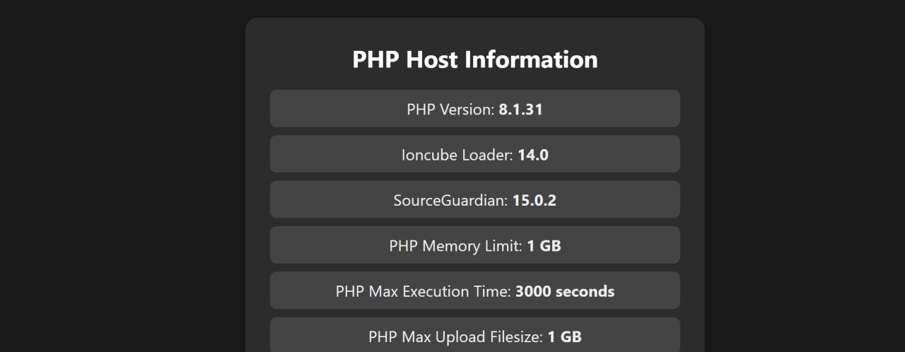

# host-php-info

**host-php-info** is a PHP script that displays detailed information about the PHP environment on your server in a clean, human-readable format. It includes essential configurations, loaded extensions, PHP settings, and other system-related data useful for debugging and system monitoring.

## Features

- **PHP Version**: Displays the PHP version installed on the server.
- **Ioncube Loader**: Shows if the Ioncube loader is installed, along with its version.
- **SourceGuardian**: Checks for SourceGuardian extension version.
- **PHP Configuration Settings**: Displays important PHP settings like memory limit, max execution time, max upload filesize, and post max size.
- **Loaded Extensions**: Lists the loaded PHP extensions such as cURL, OpenSSL, and GD.
- **Timezone Settings**: Displays the current PHP timezone setting.



## Installation

1. Download the repository or clone it using the following command:

    ```bash
    git clone https://github.com/BaseMax/host-php-info.git
    ```

2. Upload the `info.php` file to your server, ideally in a directory that’s not publicly accessible (for security reasons).

3. Access `info.php` in your browser to view your PHP host information.

## Usage

Once the script is uploaded and accessed, the following information will be displayed:

- PHP Version
- Ioncube Loader Version (if installed)
- SourceGuardian Version (if installed)
- PHP Memory Limit, Max Execution Time, Max Upload Filesize, Post Max Size
- List of PHP extensions installed on your server (like GD, cURL, OpenSSL, etc.)

### Example Output:

```txt
PHP Version: 8.1.31
Ioncube Loader: 14.0
SourceGuardian: 15.0.2
PHP Memory Limit: 1 GB
PHP Max Execution Time: 3000 seconds
PHP Max Upload Filesize: 1 GB
PHP Post Max Size: 1 GB
PHP Max Input Vars: 1000
PHP Max Input Time: 60 seconds
PHP Timezone: UTC
PHP Loaded Extensions: gd, curl, mbstring, openssl, pdo, pdo_mysql, xdebug
```

### License

MIT License

© 2025, Max Base
